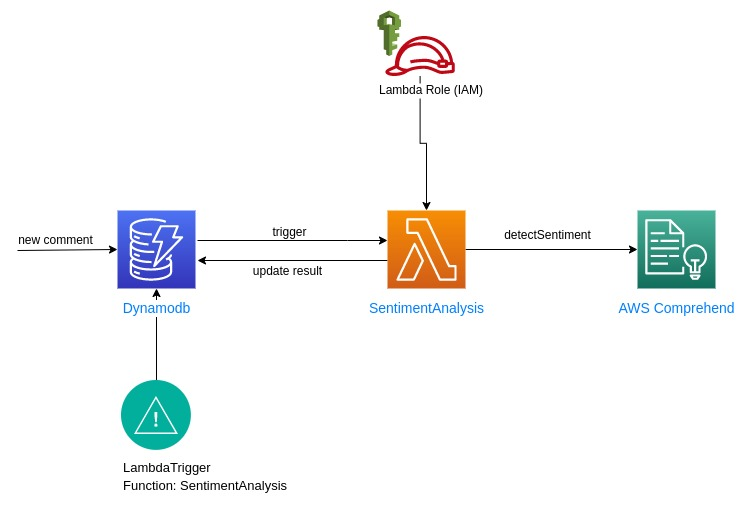

# Phân tích cảm xúc của comment sử dụng DynamoDB stream và Lamdba

Trong bài này chúng ta sẽ tạo 1 lambda function sử dụng Machine learning để phân tích cảm xúc của comment khi nó được add vào 1 dynamodb table.



## !Lưu ý: trong code có một số lỗi sai, các bạn hãy tìm và sửa lỗi đó nhé

Gợi ý: sử dụng docs của AWS và log lambda trên cloudwatch để debug

## Tóm tắt các bước:

+ 1: Tạo DynamoDB table và stream
+ 2: Tạo Lambda Execution Role
+ 3: Tạo Lambda Function
+ 4: Tạo Lambda trigger
+ 5: Test thử kết quả

1. Người dùng post 1 comment, ứng dụng sẽ lưu trữ comment vào table

1. Bản ghi mới đươc tạo ra sẽ bắn ra 1 stream để thông báo về sự thay đổi trong table đó 

1. Stream sẽ trigger lambda function

1. Lambda phân tích cảm xúc của comment, thêm thông tin vào bản ghi và update vào dynamodb


## 1: Tạo DynamoDB table và stream

#### Tạo `Comment` table

  ```
  aws dynamodb create-table \
      --table-name CommentTable \
      --attribute-definitions AttributeName=Username,AttributeType=S AttributeName=Timestamp,AttributeType=S \
      --key-schema AttributeName=Username,KeyType=HASH  AttributeName=Timestamp,KeyType=RANGE \
      --provisioned-throughput ReadCapacityUnits=1,WriteCapacityUnits=1 \
      --stream-specification StreamEnabled=true,StreamViewType=NEW_AND_OLD_IMAGES
  ```

#### Lưu lại trường `LatestStreamArn` trong output\.

  ```
  ...
  "LatestStreamArn": "arn:aws:dynamodb:region:accountID:table/CommentTable/stream/timestamp
  ...
  ```

## 2: Tạo Lambda Execution Role

1. Tạo file với tên `trust-relationship.json` có nội dung:

  ```
  {
    "Version": "2012-10-17",
    "Statement": [
      {
        "Effect": "Allow",
        "Principal": {
          "Service": "lambda.amazonaws.com"
        },
        "Action": "sts:AssumeRole"
      }
    ]
  }
  ```

1. Chạy command sau để tạo role

  ```
  aws iam create-role --role-name SentimentAnalysisLambdaRole \
      --path "/" \
      --assume-role-policy-document file://trust-relationship.json
  ```

1. Tạo file tên `role-policy.json` với nội dung: (Thay thế `region` và `accountID` và `"Resource": "arn:aws:dynamodb:region:accountID:table/CommentTable/stream/*"` tương ứng)

  ```
  {
      "Version": "2012-10-17",
      "Statement": [
          {
              "Effect": "Allow",
              "Action": [
                  "logs:CreateLogGroup",
                  "logs:CreateLogStream",
                  "logs:PutLogEvents"
              ],
              "Resource": "*"
          },
          {
              "Effect": "Allow",
              "Action": [
                  "comprehend:DetectSentiment"
              ],
              "Resource": "*"
          }
      ]
  }
  ```

1. Chạy command sau để apply policy vào role

  ```
  aws iam put-role-policy --role-name SentimentAnalysisLambdaRole \
      --policy-name SentimentAnalysisLambdaRolePolicy \
      --policy-document file://role-policy.json
  ```

## 3: Tạo Lambda Function

  ```
  aws lambda create-function \
    --function-name SentimentAnalysis \
    --runtime nodejs16.x \
    --zip-file fileb://sentiment_analysis.zip \
    --handler index.handler \
    --role arn:aws:iam::ACCOUNT_ID:role/SentimentAnalysisLambdaRole
  ```

## 4: Tạo Lambda trigger


1. Sử dụng các command sau để lấy thông tin của CommentTable

  ```
  aws dynamodb describe-table --table-name CommentTable
  ```

  Lưu lại trường `LatestStreamArn` trong output

  ```
  ...
  "LatestStreamArn": "arn:aws:dynamodb:region:accountID:table/CommentTable/stream/timestamp
  ...
  ```

1. Sử dụng command sau để tạo trigger, thay thế `streamArn` tương ứng

  ```
  aws lambda create-event-source-mapping \
      --function-name SentimentAnalysis \
      --event-source streamARN  \
      --batch-size 1 \
      --starting-position TRIM_HORIZON
      --filter-criteria '{"Filters": [{"eventName": ["INSERT"]}]}'
  ```

1. Test thử trigger:

  ```
  aws dynamodb put-item \
      --table-name CommentTable \
      --item Username={S="Anh Khoa"},Timestamp={S="2022-08-21:14:32:17"},Message={S="Good job! Keep it up!"}
  ```

## Clean up

```
aws lambda delete-function \
    --function-name SentimentAnalysis
```

```
aws dynamodb delete-table \
      --table-name CommentTable
```


```
aws iam delete-role-policy --role-name SentimentAnalysisLambdaRole \
      --policy-name SentimentAnalysisLambdaRolePolicy
```

```
aws iam delete-role \
      --role-name SentimentAnalysisLambdaRole
```