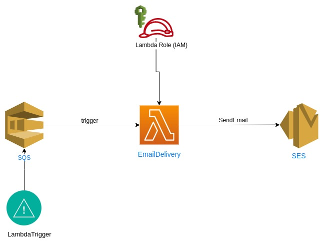

# Lambda email delivery - Gửi email bằng lambda

Khi có 1 message được gửi đến SQS queue, SQS sẽ trigger lambda function để gửi email đó đến SES



## !Lưu ý: trong code có một số lỗi sai, các bạn hãy tìm và sửa lỗi đó nhé

Gợi ý: sử dụng docs của AWS và log lambda trên cloudwatch để debug

## Tóm tắt các bước

1. Tạo SQS queue
2. Xác thực email trong SES
3. Tạo Lambda Function
4. Tạo trigger từ SQS tới Lambda
5. Test thử chức năng gửi mail

## Tạo SQS queue

Sử dụng console, tìm SQS service và tạo 1 SQS queue có tên là EmailQueue

## Xác thực email

Sử dụng console, tìm SQS service và thêm email cá nhân ở mục `Verified identities`, sẽ có email xác thực gửi đến email của bạn

## Tạo và cấu hình Lambda Function

#### Tạo IAM Role có tên là `EmailDeliveryRole` với policy:

Trust replationship

```json
{
  "Version": "2012-10-17",
  "Statement": [
    {
      "Effect": "Allow",
      "Principal": {
        "Service": "lambda.amazonaws.com"
      },
      "Action": "sts:AssumeRole"
    }
  ]
}
```

Policy document

```json
{
    "Version": "2012-10-17",
    "Statement": [
        {
            "Effect": "Allow",
            "Action": [
                "logs:CreateLogGroup",
                "logs:CreateLogStream",
                "logs:PutLogEvents"

                "sqs:ReceiveMessage",
                "sqs:DeleteMessage",
                "sqs:GetQueueAttributes",

                "ses:SendEmail",
                "ses:SendRawEmail"
            ],
            "Resource": "*"
        }
    ]
}
```

#### Lambda code (thay thế `Source` bằng email của bạn):

Tạo lamda function có tên `EmailDelivery`

```python
import os
import boto3
import botocore
import json

client = boto3.client('ses')

def lambda_handler(event, context):
    record = json.loads(event['Records'][0])
    
    try:
        email_message = {
            'Body': {
                'Text': {
                    'Data': record["message"],
                    'Charset': 'utf-8',
                }
            },
            'Subject': {
                'Charset': 'utf-8',
                'Data': record["subj"]
            },
        }
        
        ses_response = client.send_email(
            Destination={
                'ToAddresses': [record["to"]],
            },
            Message=email_message,
            Source="your.email@gmail.com"
        )
    
        print(f"ses response id received: {ses_response['MessageId']}.")

    except botocore.exceptions.ClientError as e:
        print(e.response['Error']['Message'])
    else:
        print(ses_response['MessageId'])

    return None
```

## Cấu hình SQS Lambda trigger

Cách 1: Đi tới SQS EmailQueue đã tạo, chuyển sang tab `Lambda triggers` và trỏ tới lambda đã tạo

Cách 2: Đi tới lambda `EmailDelivery`, chuyển sang tab `Configuration` -> `Triggers` -> `Add trigger` -> thêm SQS EmailQueue đã tạo

## Test thử lambda function

Quay trở lại EmailQueue, ấn button `Send and receive messages` và gửi message với nội dung:

```json
{
  "to": "your.mail@gmail.com",
  "message": "Hello Techmaster",
  "subj": "Hello World"
}
```

Mởi mailbox và kiểm tra kết quả

Chúc bạn thành công!


# Tham khảo
https://docs.aws.amazon.com/lambda/latest/dg/with-sqs.html
https://docs.aws.amazon.com/sdk-for-javascript/v2/developer-guide/ses-examples-sending-email.html
https://docs.aws.amazon.com/lambda/latest/dg/API_CreateEventSourceMapping.html#API_CreateEventSourceMapping_RequestParameters