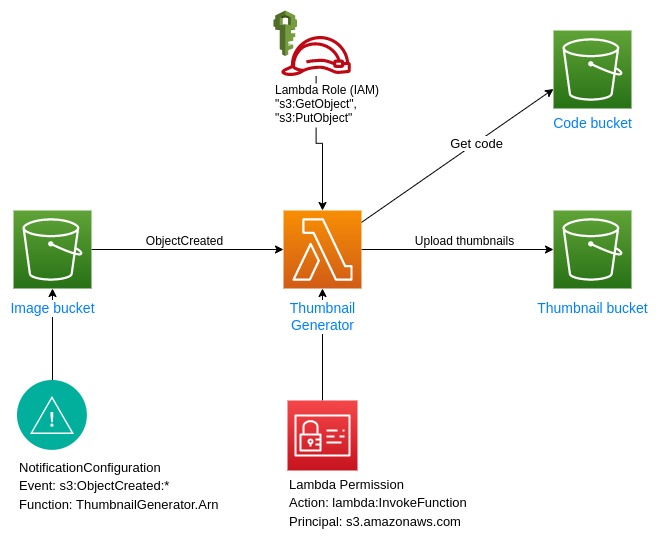

# Thumbnail generator - Tạo ảnh thumbnail bằng lambda



1. Ứng dụng nhận ảnh upload từ user và gửi lên s3
2. Ảnh được tạo mới trên s3 bucket sẽ trigger 1 event đến lambda với các thông tin cần thiết
3. Lambda xử lý tạo ảnh thumbnail từ ảnh gốc và up lên thumbnail bucket

## 1. Tạo s3 bucket để chứa code lambda

Tạo 1 bucket có dạng `${AWS::AccountId}-lambda-code-bucket` để lưu trữ code lambda

```shell
aws cloudformation create-stack --stack-name lambda-code-bucket --template-body file://lambda_code_bucket.yaml
```

## 2. Upload code lambda lên bucket vừa tạo

Kiểm tra stack đã được tạo trước khi chạy các lệnh sau

```shell
aws s3 cp --recursive --exclude '*' --include 'thumbnail_generator*.zip' . s3://$(aws cloudformation describe-stacks --query "Stacks[?StackName=='lambda-code-bucket'][].Outputs[?OutputKey=='LambdaCodeS3Bucket'].OutputValue" --output text --no-cli-pager)
```

## 3. Tạo các thành phần còn lại của function

Cloudformation:

```shell
aws cloudformation create-stack --stack-name thumbnail-generator-stack --template-body file://template_java.yaml --capabilities CAPABILITY_NAMED_IAM
```

- Image bucket & Thumbnail bucket: 2 s3 bucket để chứa ảnh upload và ảnh thumbnail được tạo ra bởi lambda
- Lambda Function: được chạy khi có event gửi đến từ Image bucket (s3:ObjectCreated:*), tạo ảnh thumbnail, và upload lên Thumbnail bucket
- Lambda Role: IAM role định nghĩa các thao tác mà lambda function được phép thực hiện (lambda có thể GET và PUT object lên s3 bucket)
- Lambda Permission: Chỉ định các user/service và các thao tác được phép thực hiện với lambda (s3.amazonaws.com có thể invokeFunction)

## 4. Thử lại với code nodejs và so sánh thời gian thực hiện cũng như lượng memory đã sử dụng!

```shell
aws cloudformation update-stack --stack-name thumbnail-generator-stack --template-body file://template_nodejs.yaml --capabilities CAPABILITY_NAMED_IAM
```

## 5. Clean up

Đi tới các bucket đã tạo và ấn button `Empty` để xóa các object trong bucket

Chạy `cloudformation delete-stack` để xóa các resource đã tạo

```shell
aws cloudformation delete-stack --stack-name lambda-code-bucket
aws cloudformation delete-stack --stack-name thumbnail-generator-stack
```